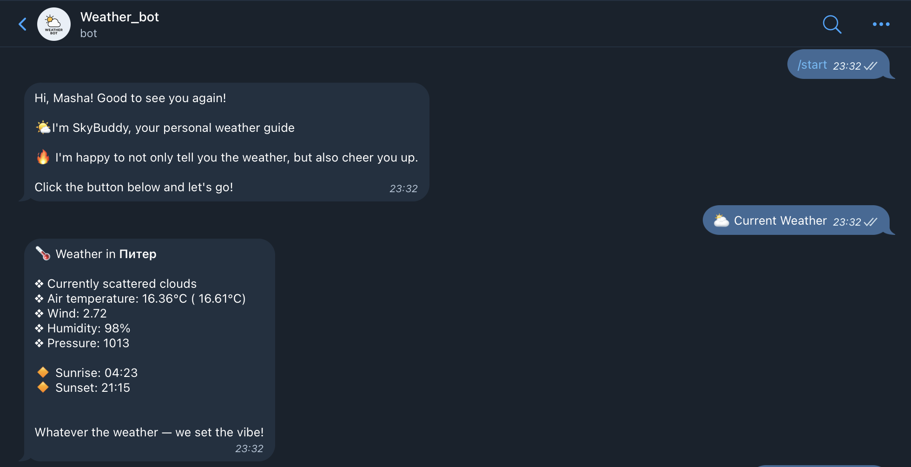

# SkyBuddy — Telegram-бот для отслеживания погоды в любой точке мира
Репозиторий для проектоной работы по реализации своего тг-бота с использованием библиотеки aiogram (или другой асинхронной библиотеки) по курсу "Основы программирования"

## Над проектом работали:
- Смирнова Ульяна Григорьевна (467518)
- Федотова Дарья Алексеевна (467852)

## Тема проекта:
**SkyBuddy** — это телеграм-бот, который предоставляет актуальную информацию о погоде по вашему городу. Он поддерживает два языка (русский и английский), предполагает в себе регистрацию пользователчя с дальнейшем запоминием данных пользователя, а также шутит по теме погоды.

## Технологии
- aiogram 3 — фреймворк Telegram-ботов
- aiohttp — асинхронные HTTP-запросы
- SQLite — база данных
- OpenWeather API — данные о погоде (получаемые по API-ключу)
- FSM (Finite State Machine)
- Кастомные middleware, inline и reply клавиатуры с callback-обработчиками, мультиязычность

## Функциональная составляющая:
- Регистрация с указанием своего имени, города и языка интерфейса
- Получение информации о погоде в своём городе с широким набором данных (температура, описание, атмосферное давление, скорость ветра, влажностоь воздуха, время восхода и заката солнца)
- Возможностоь использовать функционал бота на двух языках: **русский** и **английский**
- Редактирование данных, смена языка, города и имени
- Сброс всех данные и повторная регистрация
- Реализованы FSM, кастомные фильтры и middleware.

## Этапы запуска:
Ниже будут подробно рассмотрены все этапы запуска проекта:
1. Клонируйте репозиторий и откройте папку проекта в любой среде разработки (например, в PyCharm). Это можно сделать, например, следующим образом:
```
git clone https://github.com/ulyan4chik/Python-intro-itmo-bot.git
```

2. С помощью терминала создайте и активируйте виртуальное окружение:
```
python -m venv venv
source venv/bin/activate  # Linux/macOS
venv\Scripts\activate     # Windows
```

3. Теперь необходимо установить зависимости:
```
pip install -r requirements.txt
```

4. Создайте файл .env на основе шаблона .env.example и заполните его следующим содержимым:
```
BOT_TOKEN=your_telegram_bot_token   # Необходимо создать бота с помощью @BotFather в Телеграм и записать сюда токен созданного бота
WEATHER_API_KEY=your_weather_api_key  # необходимо получить API-ключ для реализации запросов к OpenWeatherMap. Как это сдеать опишем чуть ниже
```
Для пролучения API-ключа с ресурса OpenWeatherMap необходимо пройти регистрацию ``` https://home.openweathermap.org/users/sign_up ```. Далее подтвердить свой адрес электроннйо почты и перейти по ссылке ``` https://home.openweathermap.org/api_keys ```, которая поможет создать нужный ключ. После создания копируем и добавляем в наш .env файл. 

! Столкнулись с проблемой, что ключ не сразу активируется, поэтому если в боте ошибки - не пугайтесь, просто ключ еще не начал действовать, на это может уйти минут 7-10. Если все еще проблема, то стоит попробовать создать новый API-ключ и заменить его в .env файле :)

5. После этого возвращаемся в терминал и запускаем бота:
```
python bot.py 
```

Готово! А вот как выглядит наш готовый и запущенный проект:


